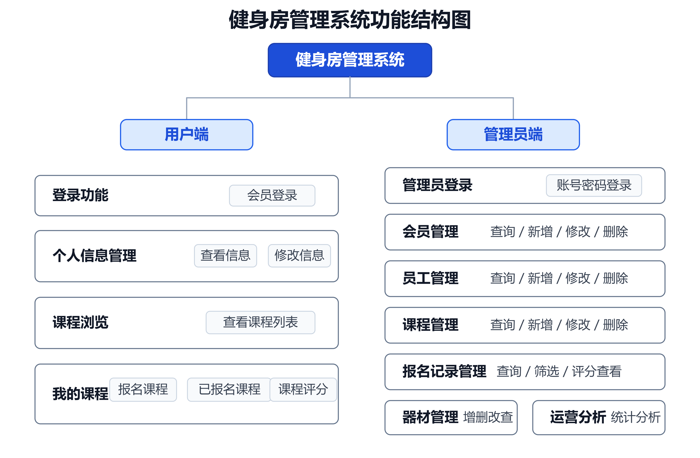
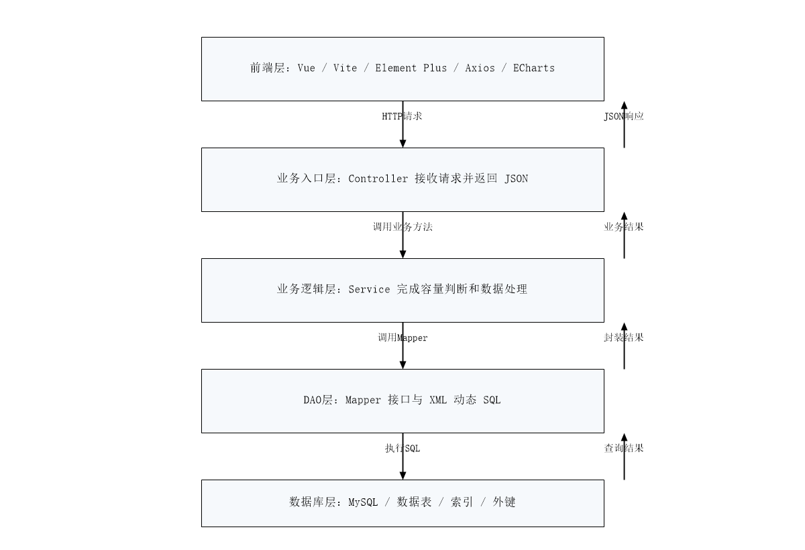
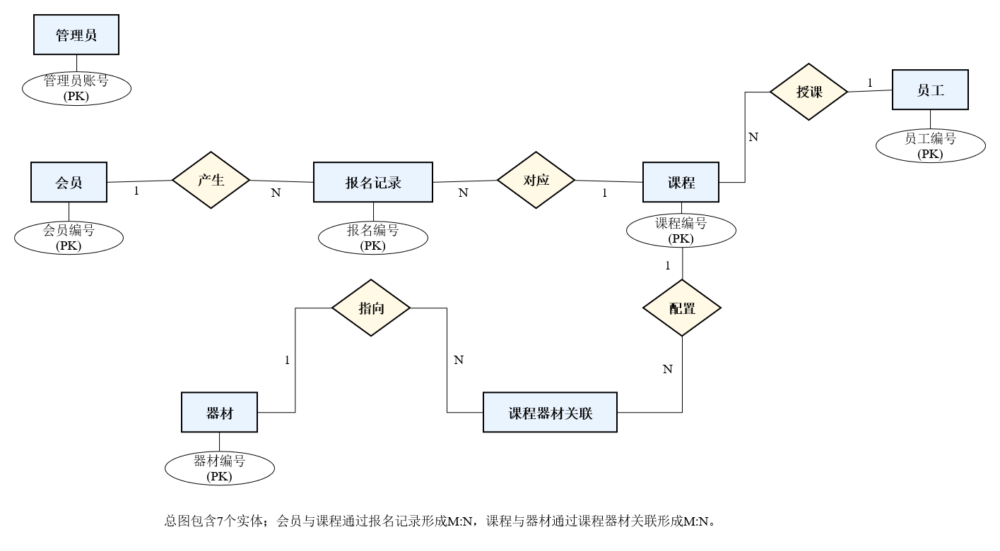
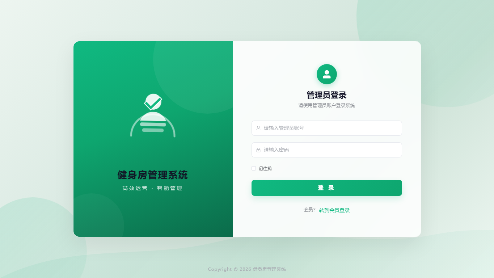
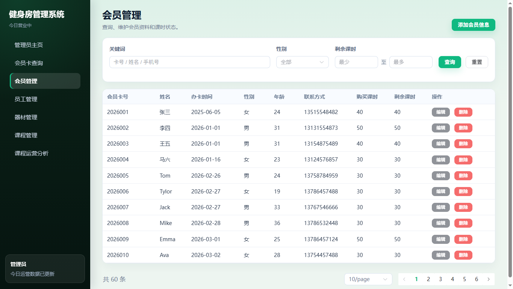
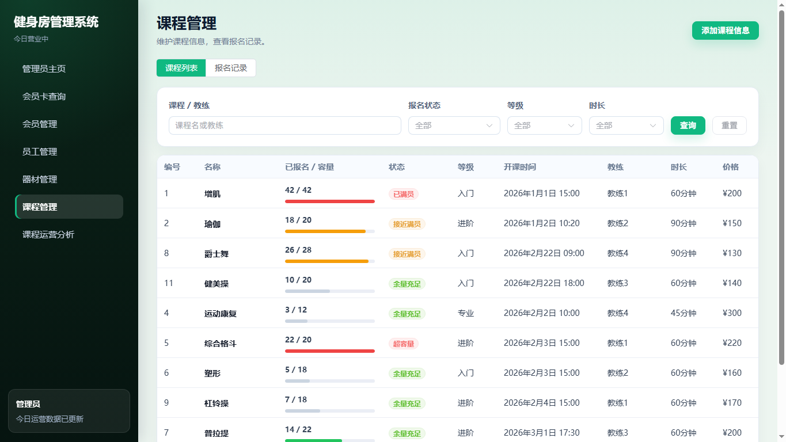
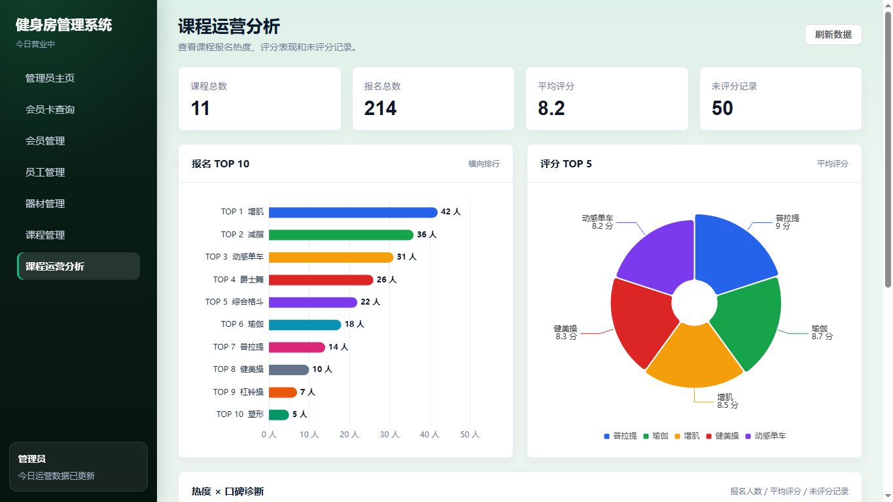
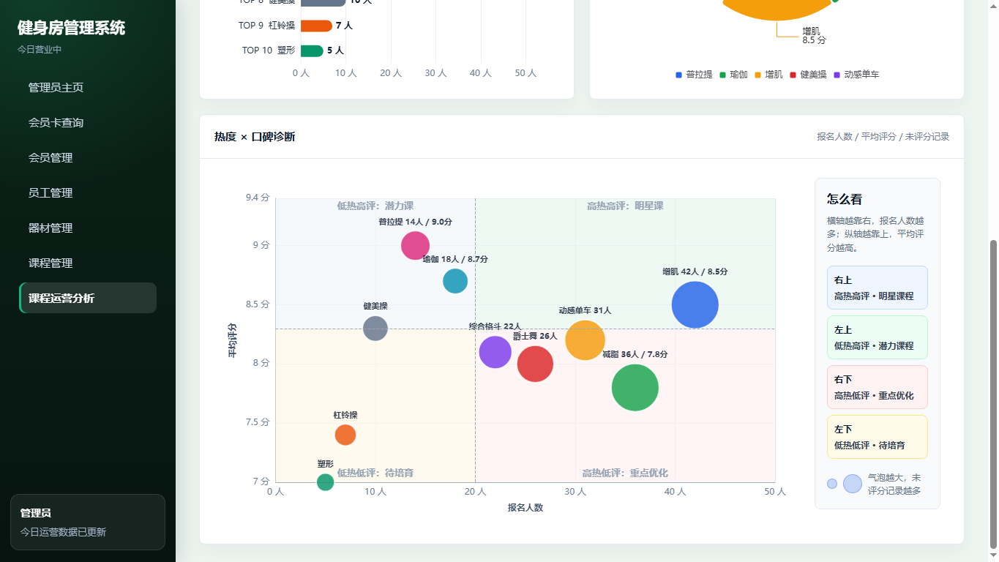
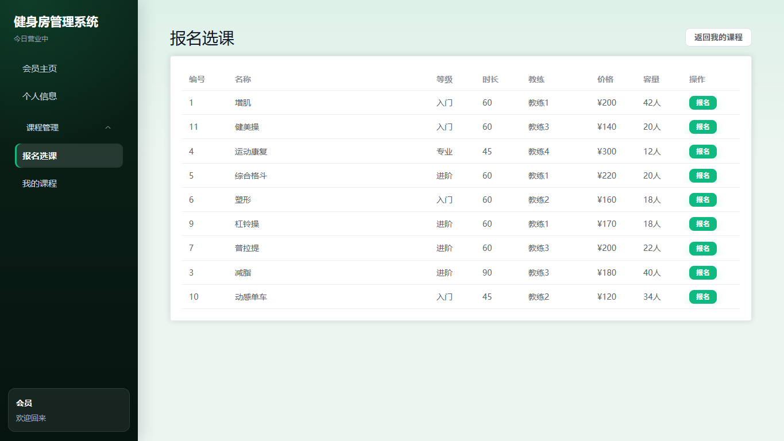

# 健身房管理系统

本项目是数据库原理课程实验作业，围绕健身房日常运营场景实现会员管理、员工管理、器材管理、课程管理、课程报名、课程评价与运营分析等功能。系统采用前后端分离架构：前端使用 Vue 3 + Vite + Element Plus，后端使用 Spring Boot + MyBatis，数据库使用 MySQL。

## 项目功能

- 管理员登录：管理员账号校验、Session 登录态维护。
- 会员管理：会员分页查询、新增、修改、删除、按会员卡查询。
- 员工管理：员工信息查询、新增、修改、删除。
- 器材管理：器材查询、新增、修改、删除，支持位置和状态筛选。
- 课程管理：课程查询、新增、删除，显示课程容量、教练、价格、报名人数等信息。
- 课程报名记录：按课程查询报名记录，维护会员与课程之间的报名关系。
- 会员端功能：会员登录、个人信息查看与修改、课程报名、已报名课程查询。
- 运营分析：课程报名排行、评分排行、统计卡片和课程分析图表展示。
- 数据库实验接口：保留若干用于课程实验演示的查询、视图和业务操作接口。

## 技术栈

| 层级 | 技术 |
| --- | --- |
| 前端 | Vue 3、TypeScript、Vite、Vue Router、Axios、Element Plus、ECharts |
| 后端 | Spring Boot 3、MyBatis、Lombok、Maven |
| 数据库 | MySQL 8 |
| 部署 | Docker、Docker Compose、Nginx |

## 目录结构

```text
.
├── README.md
├── docker-compose.yml
├── source/
│   ├── frontend/                  # Vue 前端项目
│   ├── gym-management-system/     # Spring Boot 后端项目
│   └── gym_management_system.sql  # 数据库初始化脚本
├── report_screenshots/            # 实验报告运行截图
└── report_vector_figures/         # 系统结构图、技术架构图、ER 图
```

## 系统设计图

### 系统功能结构



### 技术架构



### 总体 ER 图



## 系统运行截图

### 管理员登录



### 会员管理



### 课程管理



### 课程运营分析





### 会员端课程页面



## 快速启动：Docker Compose

推荐使用 Docker Compose 启动完整环境，包含 MySQL、后端服务和前端页面。

### 环境要求

- Docker
- Docker Compose

### 启动

```bash
docker compose up -d --build
```

启动完成后访问：

- 前端页面：http://localhost:5173
- 后端接口：http://localhost:8080
- MySQL：localhost:3306

数据库初始化脚本会在 MySQL 容器首次创建时自动执行：

```text
source/gym_management_system.sql
```

如果修改过初始化 SQL 后需要重新导入数据，可以删除 Compose 数据卷后重新启动：

```bash
docker compose down -v
docker compose up -d --build
```

### 停止

```bash
docker compose down
```

## 本地开发运行

如果不使用 Docker，也可以分别启动数据库、后端和前端。

### 1. 初始化数据库

先在本地 MySQL 中创建并导入数据库脚本：

```bash
mysql -uroot -p123456 < source/gym_management_system.sql
```

默认数据库配置：

```yaml
database: gym_db
username: root
password: 123456
port: 3306
```

如需修改数据库连接，可设置环境变量：

```bash
SPRING_DATASOURCE_URL=jdbc:mysql://localhost:3306/gym_db
SPRING_DATASOURCE_USERNAME=root
SPRING_DATASOURCE_PASSWORD=123456
```

### 2. 启动后端

```powershell
cd source/gym-management-system
.\mvnw.cmd spring-boot:run
```

后端默认运行在：

```text
http://localhost:8080
```

### 3. 启动前端

```bash
cd source/frontend
npm install
npm run dev
```

前端默认运行在：

```text
http://localhost:5173
```

开发模式下，Vite 会把 `/api` 请求代理到 `http://localhost:8080`。

## 测试账号

| 角色 | 账号 | 密码 |
| --- | --- | --- |
| 管理员 | 1001 | 123456 |
| 会员 | 2026001 | 123456 |

## 主要接口

| 模块 | 接口前缀 | 说明 |
| --- | --- | --- |
| 登录 | `/api` | 管理员登录、会员登录、退出登录、主页数据 |
| 会员 | `/api/member` | 会员查询、新增、修改、删除 |
| 员工 | `/api/employee` | 员工查询、新增、修改、删除 |
| 器材 | `/api/equipment` | 器材查询、新增、修改、删除 |
| 课程 | `/api/class` | 课程查询、报名记录、运营分析 |
| 会员端 | `/api/user` | 会员信息、报名、退课、已报名课程 |
| 实验接口 | `/api/experiment` | 数据库课程实验查询与业务操作 |

## 数据库说明

核心数据表包括：

- `admin`：管理员账号信息。
- `member`：会员基本信息与会员卡课时信息。
- `employee`：员工和教练信息。
- `equipment`：健身器材信息。
- `class_table`：课程信息。
- `class_record`：会员课程报名记录。
- `class_equipment`：课程与器材的关联关系。

数据库相关补充脚本位于：

```text
source/gym-management-system/src/main/resources/db/
```

## 打包与构建

前端构建：

```bash
cd source/frontend
npm run build
```

后端构建：

```powershell
cd source/gym-management-system
.\mvnw.cmd -DskipTests package
```
