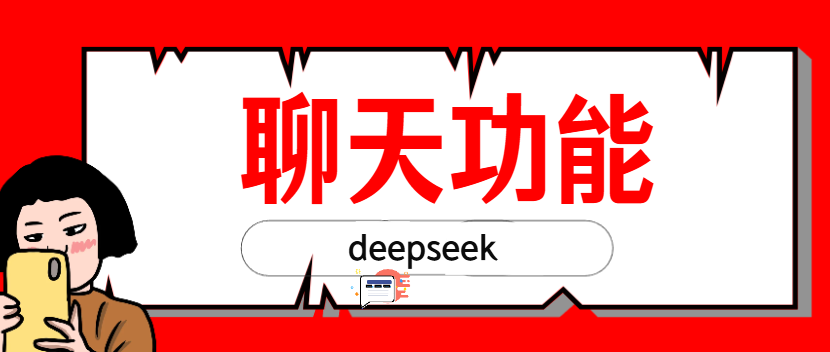

## 【百战程序员】项目简介


**项目概述**

本项目是一个**健身房管理系统**，采用**前后端分离**架构：前端负责页面与交互，后端提供 REST API、会话与数据持久化。用户分为**管理员**与**会员**：管理员维护会员、员工、器材、课程与报名订单等；会员可查看/修改个人信息、报名课程，并使用内置 **DeepSeek** 聊天功能获取训练与饮食建议。

**目录结构**

- `前端`：Vue3 + Vite + TypeScript + Element Plus
- `后端`：Spring Boot + MyBatis + MySQL+deepseek聊天接入


## 【百战程序员】创建框架


`pom.xml`

```xml
<?xml version="1.0" encoding="UTF-8"?>
<project xmlns="http://maven.apache.org/POM/4.0.0" xmlns:xsi="http://www.w3.org/2001/XMLSchema-instance"
         xsi:schemaLocation="http://maven.apache.org/POM/4.0.0 https://maven.apache.org/xsd/maven-4.0.0.xsd">
    <modelVersion>4.0.0</modelVersion>
    <parent>
        <groupId>org.springframework.boot</groupId>
        <artifactId>spring-boot-starter-parent</artifactId>
        <version>3.5.11</version>
        <relativePath/>
    </parent>
    <groupId>com.gym</groupId>
    <artifactId>gym-management-system</artifactId>
    <version>0.0.1-SNAPSHOT</version>
    <name>gym-management-system</name>
    <description>gym-management-system</description>
    <properties>
        <java.version>17</java.version>
        <mysql.version>8.0.25</mysql.version>
        <mybatis-spring-boot-starter.version>3.0.4</mybatis-spring-boot-starter.version>
    </properties>
    <dependencies>
        <dependency>
            <groupId>org.springframework.boot</groupId>
            <artifactId>spring-boot-starter-web</artifactId>
        </dependency>
        <dependency>
            <groupId>org.mybatis.spring.boot</groupId>
            <artifactId>mybatis-spring-boot-starter</artifactId>
            <version>${mybatis-spring-boot-starter.version}</version>
        </dependency>

        <dependency>
            <groupId>mysql</groupId>
            <artifactId>mysql-connector-java</artifactId>
            <version>${mysql.version}</version>
            <scope>runtime</scope>
        </dependency>
        <dependency>
            <groupId>org.projectlombok</groupId>
            <artifactId>lombok</artifactId>
            <optional>true</optional>
        </dependency>

    </dependencies>
    <build>
        <plugins>
            <plugin>
                <groupId>org.springframework.boot</groupId>
                <artifactId>spring-boot-maven-plugin</artifactId>
            </plugin>
        </plugins>
    </build>

</project>

```


**启动类**

```java
package com.gym;

import org.mybatis.spring.annotation.MapperScan;
import org.springframework.boot.SpringApplication;
import org.springframework.boot.autoconfigure.SpringBootApplication;

@SpringBootApplication
@MapperScan("com.gym.mapper")
public class GymManagementSystemApplication {

    public static void main(String[] args) {
        SpringApplication.run(GymManagementSystemApplication.class, args);
    }

}
```


## 【百战程序员】数据库与 application 配置


### `application.yml`

```yaml
spring:
  datasource:
    url: jdbc:mysql://localhost:3306/gym_management_system
    username: root
    password: 123456
    driver-class-name: com.mysql.cj.jdbc.Driver


mybatis:
  mapper-locations: classpath:mapper/*.xml
  configuration:
    map-underscore-to-camel-case: true
  type-aliases-package: com.gym.pojo

# DeepSeek 聊天配置（用于 /api/chat/query 调用）
deepseek:
  api:
    key: "your-deepseek-api-key"
    url: "https://api.deepseek.com/v1/chat/completions"
  model: "deepseek-chat"
```


## 【百战程序员】登录功能


**调用关系**

| 层级       | 类 / 文件                                                    |
| ---------- | ------------------------------------------------------------ |
| Controller | `com.gym.controller.ApiLoginController`                      |
| Service    | `com.gym.service.AdminService` → `com.gym.service.impl.AdminServiceImpl` |
| Mapper     | `com.gym.mapper.AdminMapper`                                 |
| SQL        | `backend/src/main/resources/mapper/AdminMapper.xml`          |
| 实体       | `com.gym.pojo.Admin`                                         |


### 实体 `Admin`

**文件**：`com/gym/pojo/Admin.java`

```java
package com.gym.pojo;

import lombok.Data;

@Data
public class Admin {

    private Integer adminAccount;
    private String adminPassword;
}
```


### Mapper 接口

**文件**：`com/gym/mapper/AdminMapper.java`

```java
@Mapper
public interface AdminMapper {

    Admin selectByAccountAndPassword(Admin admin);

}
```


### Mapper XML

**文件**：`src/main/resources/mapper/AdminMapper.xml`

```xml
<?xml version="1.0" encoding="UTF-8" ?>
<!DOCTYPE mapper
        PUBLIC "-//mybatis.org//DTD Mapper 3.0//EN"
        "http://mybatis.org/dtd/mybatis-3-mapper.dtd">
<mapper namespace="com.gym.mapper.AdminMapper">

    <select id="selectByAccountAndPassword" resultType="admin">
        SELECT *
        FROM admin
        WHERE admin_account = #{adminAccount}
          AND admin_password = #{adminPassword}
    </select>

</mapper>
```


### Service 接口

**文件**：`com/gym/service/AdminService.java`

```java
package com.gym.service;

import com.gym.pojo.Admin;

public interface AdminService {

    Admin adminLogin(Admin admin);
}
```


### Service 实现

**文件**：`com/gym/service/impl/AdminServiceImpl.java`

```java
@Service
public class AdminServiceImpl implements AdminService {

    @Autowired
    private AdminMapper adminMapper;

    @Override
    public Admin adminLogin(Admin admin) {
        return adminMapper.selectByAccountAndPassword(admin);
    }
}
```


### Controller

**文件**：`com/gym/controller/ApiLoginController.java`

```java
@RestController
@RequestMapping("/api")
public class ApiLoginController {

    @PostMapping("/adminLogin")
    public ResponseEntity<Map<String, Object>> adminLogin(Admin admin, HttpSession session) {
        Admin loggedIn = adminService.adminLogin(admin);
        if (loggedIn == null) {
            return unauthorized("账号或密码有误");
        }
        // 保存信息 putAdminMainDataInSession(session, loggedIn);
        return ResponseEntity.ok(singleSuccess());
    }

    private static Map<String, Object> singleSuccess() {
        Map<String, Object> m = new HashMap<>(2);
        m.put("success", true);
        return m;
    }

    private static ResponseEntity<Map<String, Object>> unauthorized(String message) {
        Map<String, Object> m = new HashMap<>(4);
        m.put("success", false);
        m.put("message", message);
        return ResponseEntity.status(HttpStatus.UNAUTHORIZED).body(m);
    }
}
```


### postman测试

- **URL**：`POST http://localhost:8080/api/adminLogin`
- **Content-Type**：`application/x-www-form-urlencoded`

- **参数示例**

  - adminAccount:1001
  - adminPassword:123456

  


## 【百战程序员】Session 数据


在账号密码校验通过之后，将：

1. **当前登录管理员**写入 Session
2. **主页用到的统计**：会员总数、员工总数、人员合计（会员+员工）、器材总数，写入 Session，供 `GET /api/toAdminMain` 等读取。


核心方法

**文件**：`com/gym/controller/ApiLoginController.java`

```java
private static final String SESSION_ADMIN = "admin";


private final MemberService memberService;
private final AdminService adminService;
private final EmployeeService employeeService;
private final EquipmentService equipmentService;

public ApiLoginController(
    MemberService memberService,
    AdminService adminService,
    EmployeeService employeeService,
    EquipmentService equipmentService) {
    this.memberService = memberService;
    this.adminService = adminService;
    this.employeeService = employeeService;
    this.equipmentService = equipmentService;
}


private void putAdminMainDataInSession(HttpSession session, Admin admin) {
    session.setAttribute(SESSION_ADMIN, admin);
    Integer memberTotal = memberService.selectTotalCount();
    Integer employeeTotal = employeeService.selectTotalCount();
    Integer humanTotal = memberTotal + employeeTotal;
    Integer equipmentTotal = equipmentService.selectTotalCount();
    session.setAttribute("memberTotal", memberTotal);
    session.setAttribute("employeeTotal", employeeTotal);
    session.setAttribute("humanTotal", humanTotal);
    session.setAttribute("equipmentTotal", equipmentTotal);
}
```


**Session 键说明**

| Session 键                 | 含义                          |
| -------------------------- | ----------------------------- |
| `admin`（`SESSION_ADMIN`） | 当前登录管理员对象            |
| `memberTotal`              | 会员表行数                    |
| `employeeTotal`            | 员工表行数                    |
| `humanTotal`               | `memberTotal + employeeTotal` |
| `equipmentTotal`           | 器材表行数                    |


**对象示例**

```java
@Data
public class Member {

    private Integer memberAccount;
    private String memberPassword;
    private String memberName;
    private String memberGender;
    private Integer memberAge;
    private Integer memberHeight;
    private Integer memberWeight;
    private Long memberPhone;
    private String cardTime;
    private Integer cardClass;
    private Integer cardNextClass;
}
```


```java
@Data
@NoArgsConstructor
@AllArgsConstructor
public class Employee {

    private Integer employeeAccount;
    private String employeeName;
    private String employeeGender;
    private Integer employeeAge;
    private String entryTime;
    private String staff;
    private String employeeMessage;
}
```


```java
@Data
@NoArgsConstructor
@AllArgsConstructor
public class Equipment {

    private Integer equipmentId;
    private String equipmentName;
    private String equipmentLocation;
    private String equipmentStatus;
    private String equipmentMessage;
}
```


**会员总数：**

**Mapper ** — `com/gym/mapper/MemberMapper.java`

```java
Integer selectTotalCount();
```

**XML** — `resources/mapper/MemberMapper.xml`

```xml
<select id="selectTotalCount" resultType="java.lang.Integer">
    SELECT count(*)
    FROM member
</select>
```

**接口** — `com/gym/service/MemberService.java`

```java
Integer selectTotalCount();
```

**实现** — `com/gym/service/impl/MemberServiceImpl.java`

```java
@Override
public Integer selectTotalCount() {
    return memberMapper.selectTotalCount();
}
```


**员工总数：**

**Mapper**  — `com/gym/mapper/EmployeeMapper.java`

```java
Integer selectTotalCount();
```

**XML** — `resources/mapper/EmployeeMapper.xml`

```xml
<select id="selectTotalCount" resultType="java.lang.Integer">
    SELECT count(*)
    FROM employee
</select>
```

**接口** — `com/gym/service/EmployeeService.java`

```java
Integer selectTotalCount();
```

**实现** — `com/gym/service/impl/EmployeeServiceImpl.java`

```java
@Override
public Integer selectTotalCount() {
    return employeeMapper.selectTotalCount();
}
```


**器材总数：**

**Mapper ** — `com/gym/mapper/EquipmentMapper.java`

```java
Integer selectTotalCount();
```

**XML** — `resources/mapper/EquipmentMapper.xml`

```xml
<select id="selectTotalCount" resultType="java.lang.Integer">
    SELECT count(*)
    FROM equipment
</select>
```

**接口** — `com/gym/service/EquipmentService.java`

```java
Integer selectTotalCount();
```

**实现** — `com/gym/service/impl/EquipmentServiceImpl.java`

```java
@Override
public Integer selectTotalCount() {
    return equipmentMapper.selectTotalCount();
}
```


**与 `adminLogin` 的衔接**

**文件**：`com/gym/controller/ApiLoginController.java`

```java
@PostMapping("/adminLogin")
public ResponseEntity<Map<String, Object>> adminLogin(Admin admin, HttpSession session) {
    Admin loggedIn = adminService.adminLogin(admin);
    if (loggedIn == null) {
        return unauthorized("账号或密码有误");
    }
    putAdminMainDataInSession(session, loggedIn);
    return ResponseEntity.ok(singleSuccess());
}
```


## 【百战程序员】员工查询


`com/gym/mapper/EmployeeMapper.java`

```java
package com.gym.mapper;

import com.gym.pojo.Employee;
import org.apache.ibatis.annotations.Mapper;

import java.util.List;

@Mapper
public interface EmployeeMapper {

    List<Employee> findAll();
}
```


**Mapper XML**
`resources/mapper/EmployeeMapper.xml`

```xml
<select id="findAll" resultType="employee">
    SELECT *
    FROM employee
</select>
```


**Service**

`com/gym/service/EmployeeService.java`

```java
public interface EmployeeService {

    List<Employee> findAll();
}
```


`backend/src/main/java/com/gym/service/impl/EmployeeServiceImpl.java`

```java
@Service
public class EmployeeServiceImpl implements EmployeeService {

    @Autowired
    private EmployeeMapper employeeMapper;

    @Override
    public List<Employee> findAll() {
        return employeeMapper.findAll();
    }
}
```


**Controller**

`com/gym/controller/ApiEmployeeController.java`

```java
package com.gym.controller;

@RestController
@RequestMapping("/api/employee")
public class ApiEmployeeController {

    @Autowired
    private EmployeeService employeeService;

    @GetMapping("/selEmployee")
    public Map<String, Object> selectEmployee() {
        List<Employee> employeeList = employeeService.findAll();
        Map<String, Object> resp = new HashMap<>();
        resp.put("success", true);
        resp.put("employeeList", employeeList);
        return resp;
    }
}
```


## 【百战程序员】新增员工


**Mapper**

`com/gym/mapper/EmployeeMapper.java`

```java
package com.gym.mapper;

import com.gym.pojo.Employee;
import org.apache.ibatis.annotations.Mapper;

@Mapper
public interface EmployeeMapper {

    Boolean insertEmployee(Employee employee);
}
```


**Mapper XML**
`resources/mapper/EmployeeMapper.xml`

```xml
<insert id="insertEmployee" parameterType="employee">
    INSERT INTO employee (employee_account, employee_name, employee_gender,
                          employee_age, entry_time, staff, employee_message)
    VALUES (#{employeeAccount}, #{employeeName}, #{employeeGender},
            #{employeeAge}, #{entryTime}, #{staff}, #{employeeMessage})
</insert>
```


**Service**

`com/gym/service/EmployeeService.java`

```java
package com.gym.service;

import com.gym.pojo.Employee;

public interface EmployeeService {

    Boolean insertEmployee(Employee employee);
}
```


`com/gym/service/impl/EmployeeServiceImpl.java`

```java
@Service
public class EmployeeServiceImpl implements EmployeeService {

    @Autowired
    private EmployeeMapper employeeMapper;

    @Override
    public Boolean insertEmployee(Employee employee) {
        return employeeMapper.insertEmployee(employee);
    }
}
```


**Controller**

`com/gym/controller/ApiEmployeeController.java`

```java
@RestController
@RequestMapping("/api/employee")
public class ApiEmployeeController {

    @Autowired
    private EmployeeService employeeService;

    @PostMapping("/addEmployee")
    public ResponseEntity<Map<String, Object>> addEmployee(Employee employee) {
        Random random = new Random();
        String account1 = "1010";
        for (int i = 0; i < 5; i++) {
            account1 += random.nextInt(10);
        }
        Integer account = Integer.parseInt(account1);

        Date date = new Date();
        SimpleDateFormat simpleDateFormat = new SimpleDateFormat("yyyy-MM-dd");
        String nowDay = simpleDateFormat.format(date);

        employee.setEmployeeAccount(account);
        employee.setEntryTime(nowDay);

        employeeService.insertEmployee(employee);

        Map<String, Object> resp = new HashMap<>();
        resp.put("success", true);
        return ResponseEntity.ok(resp);
    }
}
```


## 【百战程序员】删除员工


**Mapper**
`com/gym/mapper/EmployeeMapper.java`

```java
package com.gym.mapper;

import org.apache.ibatis.annotations.Mapper;

@Mapper
public interface EmployeeMapper {

    Boolean deleteByEmployeeAccount(Integer employeeAccount);
}
```


**Mapper XML** 
`resources/mapper/EmployeeMapper.xml`

```xml
<delete id="deleteByEmployeeAccount" parameterType="java.lang.Integer">
    DELETE
    FROM employee
    WHERE employee_account = #{employeeAccount}
</delete>
```


`com/gym/service/EmployeeService.java`

```java
package com.gym.service;

public interface EmployeeService {

    Boolean deleteByEmployeeAccount(Integer employeeAccount);
}
```


`com/gym/service/impl/EmployeeServiceImpl.java`

```java
@Service
public class EmployeeServiceImpl implements EmployeeService {

    @Autowired
    private EmployeeMapper employeeMapper;

    @Override
    public Boolean deleteByEmployeeAccount(Integer employeeAccount) {
        return employeeMapper.deleteByEmployeeAccount(employeeAccount);
    }
}
```


**Controller**

`com/gym/controller/ApiEmployeeController.java`

```java
@RestController
@RequestMapping("/api/employee")
public class ApiEmployeeController {

    @Autowired
    private EmployeeService employeeService;

    @PostMapping("/delEmployee")
    public ResponseEntity<Map<String, Object>> deleteEmployee(Integer employeeAccount) {
        employeeService.deleteByEmployeeAccount(employeeAccount);
        Map<String, Object> resp = new HashMap<>();
        resp.put("success", true);
        return ResponseEntity.ok(resp);
    }
}
```


## 【百战程序员】修改员工


**Mapper**
`com/gym/mapper/EmployeeMapper.java`

```java
package com.gym.mapper;

import com.gym.pojo.Employee;
import org.apache.ibatis.annotations.Mapper;

@Mapper
public interface EmployeeMapper {

    Boolean updateMemberByEmployeeAccount(Employee employee);
}
```


**Mapper XML** 
`resources/mapper/EmployeeMapper.xml`

```xml
<update id="updateMemberByEmployeeAccount" parameterType="employee">
    UPDATE employee
    SET employee_account = #{employeeAccount},
        employee_name    = #{employeeName},
        employee_gender  = #{employeeGender},
        employee_age     = #{employeeAge},
        staff            = #{staff},
        employee_message=#{employeeMessage}
    WHERE employee_account = #{employeeAccount}
</update>
```


**Service**

`com/gym/service/EmployeeService.java`

```java
package com.gym.service;

import com.gym.pojo.Employee;

public interface EmployeeService {

    Boolean updateMemberByEmployeeAccount(Employee employee);
}
```


`com/gym/service/impl/EmployeeServiceImpl.java`

```java
@Service
public class EmployeeServiceImpl implements EmployeeService {

    @Autowired
    private EmployeeMapper employeeMapper;

    @Override
    public Boolean updateMemberByEmployeeAccount(Employee employee) {
        return employeeMapper.updateMemberByEmployeeAccount(employee);
    }
}
```


**Controller**
`com/gym/controller/ApiEmployeeController.java`

```java
@RestController
@RequestMapping("/api/employee")
public class ApiEmployeeController {

    @Autowired
    private EmployeeService employeeService;

    @PostMapping("/updateEmployee")
    public ResponseEntity<Map<String, Object>> updateEmployee(Employee employee) {
        employeeService.updateMemberByEmployeeAccount(employee);
        Map<String, Object> resp = new HashMap<>();
        resp.put("success", true);
        return ResponseEntity.ok(resp);
    }
}
```


**跳转修改列表**

```java
@GetMapping("/toUpdateEmployee")
public Map<String, Object> toUpdateEmployee(Integer employeeAccount) {
    List<Employee> employeeList = employeeService.selectByEmployeeAccount(employeeAccount);
    Map<String, Object> resp = new HashMap<>();
    resp.put("success", true);
    resp.put("employeeList", employeeList);
    return resp;
}
```


**Service**

```java
List<Employee> selectByEmployeeAccount(Integer employeeAccount);
```

```java
@Override
public List<Employee> selectByEmployeeAccount(Integer employeeAccount) {
    return employeeMapper.selectByEmployeeAccount(employeeAccount);
}
```


**Mapper**

```java
List<Employee> selectByEmployeeAccount(Integer employeeAccount);
```

```xml
<select id="selectByEmployeeAccount" parameterType="java.lang.Integer" resultType="employee">
    SELECT *
    FROM employee
    WHERE employee_account = #{employeeAccount}
</select>
```


## 【百战程序员】DeepSeek聊天功能





**DeepSeek获取接口网址：**

https://platform.deepseek.com/sign_in


`com/gym/service/ChatService.java`

```java
package com.gym.service;

public interface ChatService {

    /**
     * @param content 用户输入
     * @param model   DeepSeek 模型，允许为空（为空则使用默认模型）
     * @return AI 回复文本
     */
    String queryChat(String content, String model);
}
```


`com/gym/service/impl/ChatServiceImpl.java`

```java
@Service
public class ChatServiceImpl implements ChatService {

    @Value("${deepseek.api.key}")
    private String apiKeyFromConfig;

    @Value("${deepseek.api.url:https://api.deepseek.com/v1/chat/completions}")
    private String apiUrl;

    @Value("${deepseek.model:deepseek-chat}")
    private String defaultModel;

    @Override
    public String queryChat(String content, String model) {
        String userContent = content == null ? "" : content.trim();
        if (userContent.isEmpty()) {
            return "我还没收到你的问题，可以再发一次吗？";
        }

        String resolvedModel = (model == null || model.trim().isEmpty()) ? defaultModel : model.trim();
        String apiKey = apiKeyFromConfig;
        if (apiKey == null || apiKey.trim().isEmpty()) {
            apiKey = System.getenv("DEEPSEEK_API_KEY");
        }
        if (apiKey == null || apiKey.trim().isEmpty()) {
            throw new IllegalStateException("未配置 DeepSeek API Key");
        }

        try {
            ObjectMapper objectMapper = new ObjectMapper();

            Map<String, Object> payload = new HashMap<>();
            payload.put("model", resolvedModel);
            payload.put("stream", false);

            List<Map<String, String>> messages = new ArrayList<>();
            messages.add(new HashMap<String, String>() {{
                put("role", "system");
                put("content", "你是一个健身房训练与饮食建议助手。回答要具体、可执行，并给出需要的注意事项。"
                        + "如果用户消息中包含“系统补充信息”里列出的会员课程，请先用简短的中文总结出“该会员报名了哪些课程”，"
                        + "然后再结合这些课程安排来回答用户的后续问题。");
            }});
            messages.add(new HashMap<String, String>() {{
                put("role", "user");
                put("content", userContent);
            }});
            payload.put("messages", messages);

            String requestBody = objectMapper.writeValueAsString(payload);

            HttpURLConnection connection = (HttpURLConnection) new URL(apiUrl).openConnection();
            connection.setRequestMethod("POST");
            connection.setDoOutput(true);
            connection.setRequestProperty("Authorization", "Bearer " + apiKey);
            connection.setRequestProperty("Content-Type", "application/json; charset=UTF-8");

            OutputStream os = connection.getOutputStream();
            os.write(requestBody.getBytes(StandardCharsets.UTF_8));
            os.flush();
            os.close();

            int statusCode = connection.getResponseCode();
            InputStream is = statusCode >= 200 && statusCode < 300 ? connection.getInputStream() : connection.getErrorStream();
            String responseBody = readAll(is);

            if (statusCode < 200 || statusCode >= 300) {
                throw new RuntimeException("DeepSeek API 请求失败，status=" + statusCode + ", body=" + responseBody);
            }

            JsonNode root = objectMapper.readTree(responseBody);
            JsonNode choices = root.path("choices");
            if (choices.isArray() && choices.size() > 0) {
                JsonNode message = choices.get(0).path("message");
                String reply = message.path("content").asText(null);
                if (reply != null && !reply.trim().isEmpty()) {
                    return reply;
                }
            }

            throw new RuntimeException("DeepSeek 返回无法解析：choices[0].message.content 为空");
        } catch (IOException e) {
            throw new RuntimeException("DeepSeek 调用失败：" + e.getMessage(), e);
        }
    }

    private String readAll(InputStream is) throws IOException {
        if (is == null) return "";
        StringBuilder sb = new StringBuilder();
        BufferedReader br = new BufferedReader(new InputStreamReader(is, StandardCharsets.UTF_8));
        String line;
        while ((line = br.readLine()) != null) {
            sb.append(line);
        }
        br.close();
        return sb.toString();
    }
}
```


## 【百战程序员】会员课程信息


`com/gym/controller/ApiChatController.java`

```java
@RestController
@RequestMapping("/api/chat")
public class ApiChatController {

    @Autowired
    private ChatService chatService;

    @Autowired
    private ClassOrderService classOrderService;

    @PostMapping("/query")
    public Map<String, Object> query(
            @RequestParam("content") String content,
            @RequestParam(required = false) String model,
            HttpSession session
    ) {
        Map<String, Object> resp = new HashMap<>();
        try {
            Member member = (Member) session.getAttribute("user");
            String enhancedContent = buildContentWithMemberClasses(content, member);

            String reply = chatService.queryChat(enhancedContent, model);
            resp.put("success", true);
            resp.put("reply", reply);
        } catch (Exception e) {
            resp.put("success", false);
            resp.put("message", e.getMessage());
        }
        return resp;
    }

    private String buildContentWithMemberClasses(String originalContent, Member member) {
        if (member == null || member.getMemberAccount() == null) {
            return originalContent;
        }

        List<ClassOrder> classOrders = classOrderService.selectClassOrderByMemberAccount(member.getMemberAccount());
        if (classOrders == null || classOrders.isEmpty()) {
            return originalContent;
        }

        String classInfo = classOrders.stream()
                .map(order -> String.format(
                        "课程名称：%s，教练：%s，上课时间：%s",
                        order.getClassName(),
                        order.getCoach(),
                        order.getClassBegin()
                ))
                .collect(Collectors.joining("；"));

        String memberInfo = String.format("会员姓名：%s，会员账号：%s",
                member.getMemberName(), member.getMemberAccount());

        StringBuilder sb = new StringBuilder();
        sb.append(originalContent == null ? "" : originalContent.trim());
        sb.append("\n\n");
        sb.append("【系统补充信息】下面是该会员当前已报名的课程信息，请先根据这些信息，明确地告诉用户“我报名了哪些课程”，然后再结合课程安排回答后续问题：\n");
        sb.append(memberInfo).append("\n");
        sb.append(classInfo);
        return sb.toString();
    }
}
```


## 【百战程序员】会话鉴权


> **问题**：在未登录的情况下输入网址
>
> http://localhost:8080/api/employee/selEmployee
>
> http://localhost:5173/member/selMember


**统一会话鉴权拦截器**

`com/gym/security/SessionAuthInterceptor.java`

```java
@Component
public class SessionAuthInterceptor implements HandlerInterceptor {

    private final ObjectMapper objectMapper;

    public SessionAuthInterceptor(ObjectMapper objectMapper) {
        this.objectMapper = objectMapper;
    }

    private boolean isPublicApi(String uri) {
        return uri == null
                || uri.startsWith("/api/adminLogin")
                || uri.startsWith("/api/userLogin")
                || uri.startsWith("/api/logout");
    }

    private boolean isUserApi(String uri) {
        return uri != null && (
                uri.equals("/api/toUserMain")
                        || uri.startsWith("/api/user/")
                        || uri.startsWith("/api/chat/")
        );
    }

    @Override
    public boolean preHandle(HttpServletRequest request, HttpServletResponse response, Object handler) throws Exception {
        if ("OPTIONS".equalsIgnoreCase(request.getMethod())) {
            return true;
        }

        String uri = request.getRequestURI();
        if (uri == null || !uri.startsWith("/api/")) {
            return true;
        }

        if (isPublicApi(uri)) {
            return true;
        }

        boolean requireUser = isUserApi(uri);
        String requiredSessionKey = requireUser ? "user" : "admin";

        HttpSession session = request.getSession(false);
        if (session != null && session.getAttribute(requiredSessionKey) != null) {
            return true;
        }

        response.setStatus(HttpServletResponse.SC_UNAUTHORIZED);
        response.setCharacterEncoding(StandardCharsets.UTF_8.name());
        response.setContentType(MediaType.APPLICATION_JSON_VALUE);

        Map<String, Object> resp = new HashMap<>();
        resp.put("success", false);
        resp.put("message", "未登录");
        response.getWriter().write(objectMapper.writeValueAsString(resp));
        return false;
    }
}
```


 **注册拦截器**

`com/gym/config/WebMvcConfig.java`

```java
@Configuration
public class WebMvcConfig implements WebMvcConfigurer {

    private final SessionAuthInterceptor sessionAuthInterceptor;

    public WebMvcConfig(SessionAuthInterceptor sessionAuthInterceptor) {
        this.sessionAuthInterceptor = sessionAuthInterceptor;
    }

    @Override
    public void addCorsMappings(CorsRegistry registry) {
        registry.addMapping("/**")
                .allowedOrigins("http://localhost:5173")
                .allowedMethods("GET", "POST", "PUT", "PATCH", "DELETE", "OPTIONS")
                .allowedHeaders("*")
                .allowCredentials(true);
    }

    @Override
    public void addInterceptors(InterceptorRegistry registry) {
        registry.addInterceptor(sessionAuthInterceptor)
                .addPathPatterns("/api/**")
                .excludePathPatterns(
                        "/api/adminLogin",
                        "/api/userLogin",
                        "/api/logout"
                );
    }
}
```


